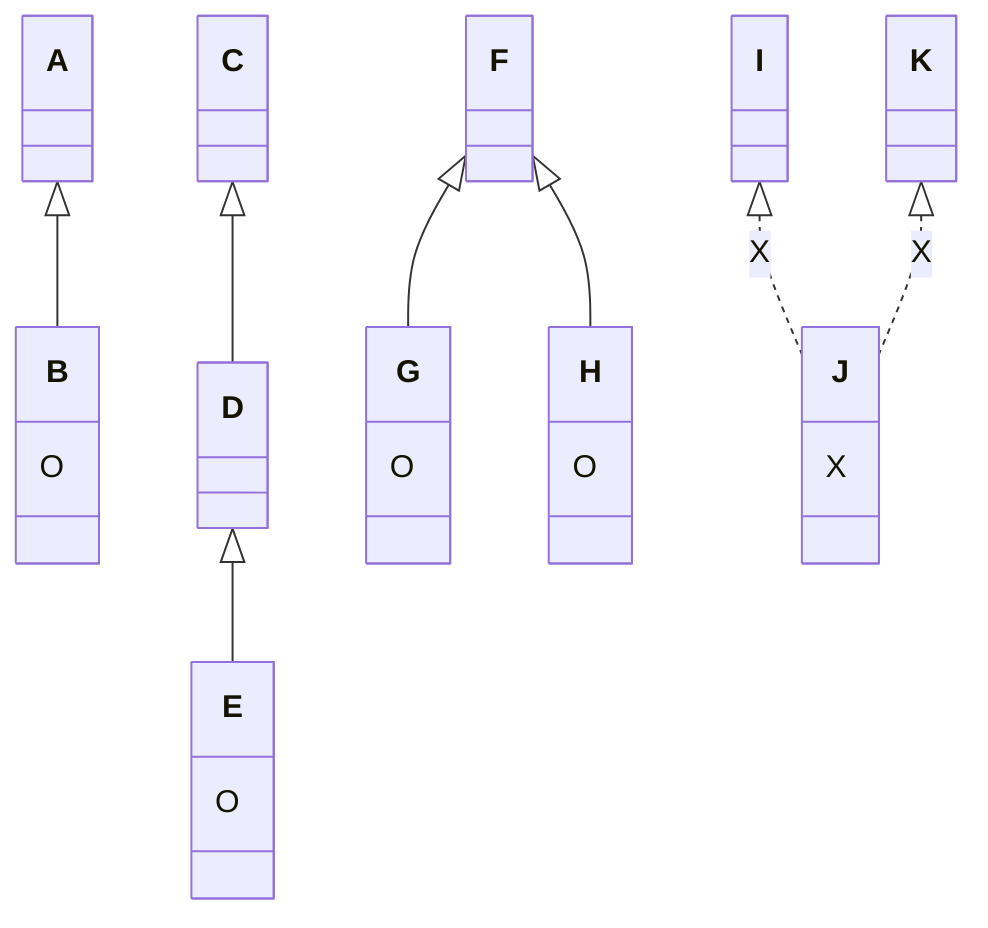

# 继承 Inheritance

## 继承的特性 (is-a)
+ 子类拥有父类非 private 的属性、方法。

+ 子类可以对父类进行扩展。

+ 子类可以用自己的方式实现父类的方法。

+ 提高了类之间的耦合性（继承的缺点，耦合度高就会造成代码之间的联系越紧密，代码独立性越差）。**多态的前提(Polymorphism)**

+ Java 的继承是单继承，但是可以多重继承、不同类继承于同一类。**不可以多继承**



## 继承关键词(Modifiers) 

### *extends & implements*
+ 类与类的关系：*extends* **类继承一个类**
+ 类与接口的关系：*implements* **类实现多个接口** (*interface*)
+ 接口与接口的关系：*extends* **接口继承多个接口**

### *super* 和 *this*
+ *super*：实现对父类成员的访问，用来引用当前对象的父类。
+ *this*：指向自己的引用。

```Java
class Animal {
  void eat() {
    System.out.println("animal : eat");
  }
}
 
class Dog extends Animal {
  void eat() {
    System.out.println("dog : eat");
  }
  void eatTest() {
    this.eat();   // this 调用自己的方法
    super.eat();  // super 调用父类方法
  }
}
```
### *final*
+ 可以修饰变量、方法、类。
+ 修饰类： 不可被继承。（最终类）
+ 修饰方法： 不可被重写。

## 继承中的构造函数 *Constructor*
+ 子类不继承父类的构造器，只是调用。
+ 如果要使用父类有参构造器，则需要使用 *super(合适的参数)* 进行调用。
+ 如果要使用父类的无参的默认构造器，则不需要额外操作，系统会自动调用。

```Java
class SuperClass {
  private int n;
  SuperClass(){
    System.out.println("SuperClass()");
  }
  SuperClass(int n) {
    System.out.println("SuperClass(int n)");
    this.n = n;
  }
}
// SubClass 类继承
class SubClass extends SuperClass{
  private int n;
  
  SubClass(){ // 自动调用父类的无参数构造器
    System.out.println("SubClass");
  }  
  
  public SubClass(int n){ 
    super(300);  // 调用父类中带有参数的构造器
    System.out.println("SubClass(int n):"+n);
    this.n = n;
  }
}
// SubClass2 类继承
class SubClass2 extends SuperClass{
  private int n;
  
  SubClass2(){
    super(300);  // 调用父类中带有参数的构造器
    System.out.println("SubClass2");
  }  
  
  public SubClass2(int n){ // 自动调用父类的无参数构造器
    System.out.println("SubClass2(int n):"+n);
    this.n = n;
  }
}
```
